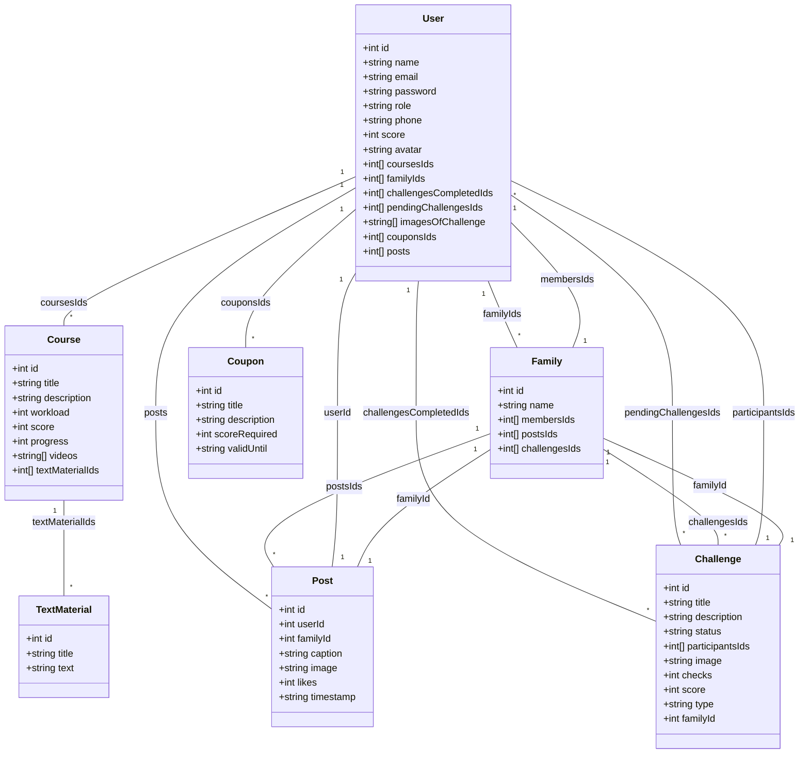

```mermaid
classDiagram
  class User {
    +int id
    +string name
    +string email
    +string password
    +string role
    +string phone
    +int score
    +string avatar
    +int[] coursesIds
    +int[] familyIds
    +int[] challengesCompletedIds
    +int[] pendingChallengesIds
    +string[] imagesOfChallenge
    +int[] couponsIds
    +int[] posts
  }
  class Challenge {
    +int id
    +string title
    +string description
    +string status
    +int[] participantsIds
    +string image
    +int checks
    +int score
    +string type
    +int familyId
  }
  class Course {
    +int id
    +string title
    +string description
    +int workload
    +int score
    +int progress
    +string[] videos
    +int[] textMaterialIds
  }
  class TextMaterial {
    +int id
    +string title
    +string text
  }
  class Family {
    +int id
    +string name
    +int[] membersIds
    +int[] postsIds
    +int[] challengesIds
  }
  class Post {
    +int id
    +int userId
    +int familyId
    +string caption
    +string image
    +int likes
    +string timestamp
  }
  class Coupon {
    +int id
    +string title
    +string description
    +int scoreRequired
    +string validUntil
  }

  User "1" -- "*" Course : coursesIds
  User "1" -- "*" Family : familyIds
  User "1" -- "*" Challenge : challengesCompletedIds
  User "1" -- "*" Challenge : pendingChallengesIds
  User "1" -- "*" Coupon : couponsIds
  User "1" -- "*" Post : posts
  Challenge "1" -- "*" User : participantsIds
  Challenge "1" -- "1" Family : familyId
  Course "1" -- "*" TextMaterial : textMaterialIds
  Family "1" -- "*" User : membersIds
  Family "1" -- "*" Post : postsIds
  Family "1" -- "*" Challenge : challengesIds
  Post "1" -- "1" User : userId
  Post "1" -- "1" Family : familyId

```
