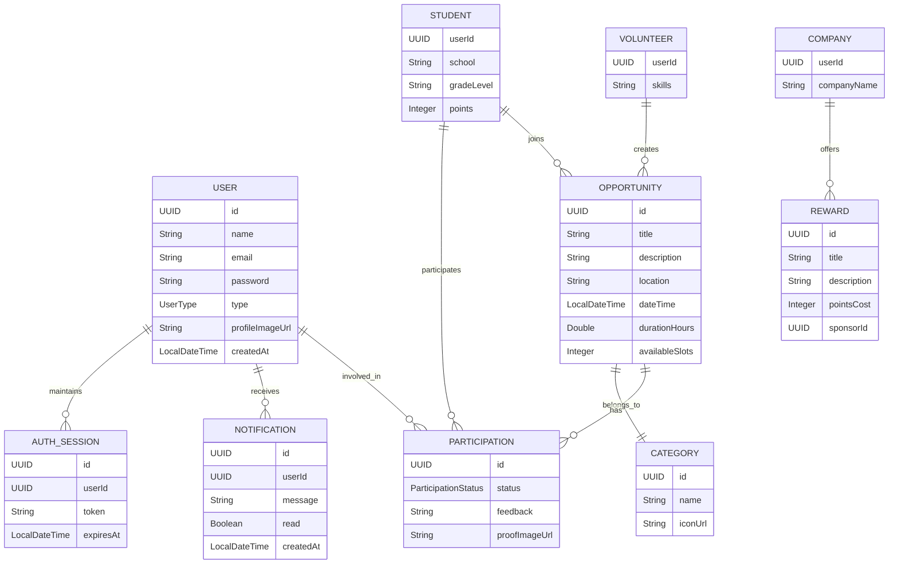

```mermaid
erDiagram

USER ||--o{ AUTH_SESSION : maintains
USER ||--o{ NOTIFICATION : receives
USER ||--o{ PARTICIPATION : involved_in

STUDENT ||--o{ PARTICIPATION : participates
STUDENT ||--o{ OPPORTUNITY : joins

VOLUNTEER ||--o{ OPPORTUNITY : creates
COMPANY ||--o{ REWARD : offers

OPPORTUNITY ||--|| CATEGORY : belongs_to
OPPORTUNITY ||--o{ PARTICIPATION : has

PARTICIPATION {
  UUID id
  ParticipationStatus status
  String feedback
  String proofImageUrl
}

USER {
  UUID id
  String name
  String email
  String password
  UserType type
  String profileImageUrl
  LocalDateTime createdAt
}

STUDENT {
  UUID userId
  String school
  String gradeLevel
  Integer points
}

VOLUNTEER {
  UUID userId
  String skills
}

COMPANY {
  UUID userId
  String companyName
}

OPPORTUNITY {
  UUID id
  String title
  String description
  String location
  LocalDateTime dateTime
  Double durationHours
  Integer availableSlots
}

CATEGORY {
  UUID id
  String name
  String iconUrl
}

REWARD {
  UUID id
  String title
  String description
  Integer pointsCost
  UUID sponsorId
}

AUTH_SESSION {
  UUID id
  UUID userId
  String token
  LocalDateTime expiresAt
}

NOTIFICATION {
  UUID id
  UUID userId
  String message
  Boolean read
  LocalDateTime createdAt
}

```
